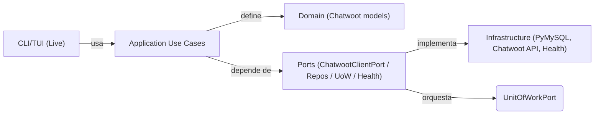

# Arquitectura (Fase 1)

## Capas y dependencias
Domain -> Application -> Interface Adapters -> Infrastructure

- Domain: entidades y reglas puras.
- Application: casos de uso y puertos (interfaces).
- Interface Adapters: controllers/presenters/gateways.
- Infrastructure: DB, API clients, CLI/TUI (PyMySQL unificado).

## Puertos clave
- ChatwootClientPort (API externa)
- Repositories (Accounts/Inboxes/Conversations/Messages)
- UnitOfWorkPort

## Flujo principal (sync)
CLI -> Application Use Case -> Ports -> Infrastructure (DB/API)

## Notas
- UI/UX AS/400 vive como adaptador externo.
- UoW garantiza commit/rollback por operacion.

## Tree de arquitectura (actual)
```
src/
  domain/
    chatwoot/
      models.py
  application/
    ports/
      chatwoot_client.py
      repositories.py
      unit_of_work.py
    use_cases/
      accounts_sync.py
      inboxes_sync.py
      conversations_sync.py
      messages_sync.py
      health_check.py
      init_db.py
  interface_adapter/
    controllers/
    presenter/
    gateways/
  infrastructure/
    chatwoot_api/
    pymysql/
    CLI/
  shared/
```

## Diagrama Mermaid sugerido

